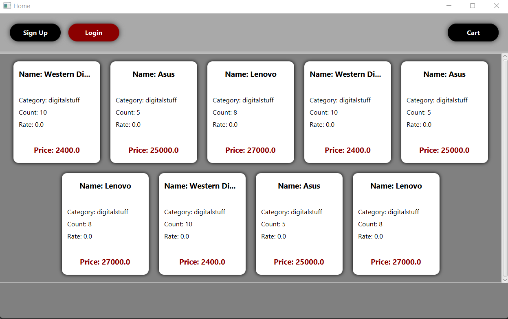
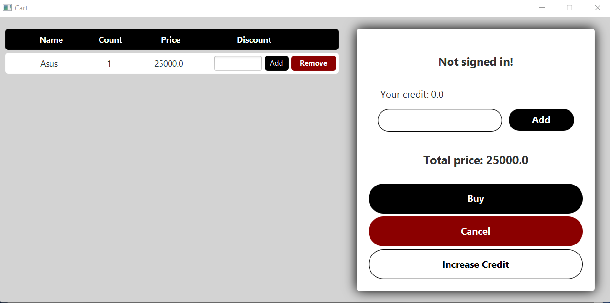
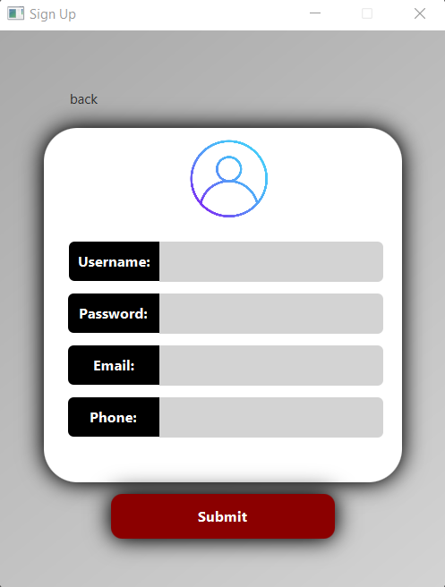

# Online shop

# A project with JAVA and JAVAFX to simulate an online shop application.

## Images

## To Do List:

    -Pages:

[x] Home page
[x] Login and Sign Up
[x] Cart page
[x] Stuff page
[ ] Admin Page

### -------------------------

    Logics:

[x] Login and Sign Up
[x] Request to add comment
[x] Request to add rate
[x] Request to increase credit
[x] Add stuff to cart
[ ] Add discount
[x] Edit profile
[x] Check RegEx
[ ] Chance circle
[ ] Accept comment request
[ ] Accept increase credit request
[x] Finalize buy
[ ] Create discount
